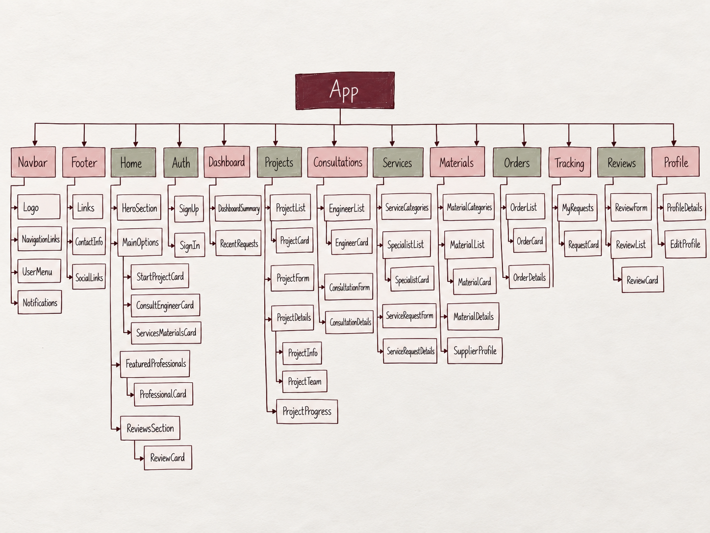

# BUNYAN

BUNYAN is an engineering and property services platform that brings clients, engineers, specialists, and building-material suppliers together in one place.

A client can use the platform to start a full engineering project, request a consultation with an engineer, find a specialist for a smaller job, browse building materials, place orders, and follow the progress of their requests.

BUNYAN also provides different dashboards and permissions for clients, engineers, specialists, suppliers, and administrators.

The aim of BUNYAN is to make the process of building, renovating, and finding engineering or property services easier by bringing the main services together in one platform.

---

## Back-End Application

The FastAPI back-end and API can be viewed here:

[BUNYAN Back-End Repository](https://github.com/Mrymhussain/bunyan-back-end)

[Deployed Back-End](https://bunyan-back-end.onrender.com)

---

## Getting Started

### Deployed App

[BUNYAN Live Application](https://bunyan-front-end.onrender.com)

### Wireframes

The wireframes were planned and created using Excalidraw.

[View Excalidraw](https://excalidraw.com/)

### Front-End Repository

[BUNYAN Front-End](https://github.com/Mrymhussain/bunyan-front-end)

### Back-End Repository

[BUNYAN Back-End](https://github.com/Mrymhussain/bunyan-back-end)

---

## Planning

### ERD

The ERD shows the main entities in the system and how they are related.

The main entities in the system are:

- User
- Project
- ProjectMember
- ProjectUpdate
- Consultation
- ServiceRequest
- ServiceCategory
- Material
- Order
- OrderItem
- Review

---

## Component Hierarchy

The component hierarchy shows how the front-end application is organized and how the main pages and components are connected.

---

## User Stories

### Users

- As a user, I want to create an account so I can use the platform.
- As a user, I want to sign in so I can access my account.
- As a user, I want to sign out when I finish using the application.
- As a user, I want to view and update my profile.
- As a user, I want to see a dashboard based on my role.

### Projects

- As a client, I want to create a project request with the details of my project.
- As a client, I want to view all of my projects.
- As a client, I want to view the status and progress of my project.
- As a client, I want to edit the request details of my own project.
- As a client, I want to see the engineers assigned to my project.
- As an admin, I want to view all projects.
- As an admin, I want to assign engineers to a project.
- As an admin, I want to remove engineers from a project.
- As an engineer, I want to view the projects assigned to me.
- As an engineer, I want to update the progress and status of an assigned project.

### Project Room

- As a client, I want to view project updates from the engineering team.
- As a client, I want to post updates inside my project.
- As an assigned engineer, I want to post updates inside the project room.
- As an assigned engineer, I want to approve my own engineering discipline.
- As an engineer, I want to add an approval note for my discipline.
- As an admin, I want to monitor the project room and engineering team.
- As a project member, I want to view the shared project meeting details.
- As an engineer or admin, I want to update the project meeting information and meeting link.

### Professionals

- As a client, I want to browse engineers and specialists.
- As a client, I want to view professionals based on their specialty.
- As a client, I want to view a professional's profile before requesting a service.
- As a client, I want to view ratings and reviews for professionals.

### Consultations

- As a client, I want to request a consultation with an engineer.
- As a client, I want to choose the consultation details and preferred time.
- As a client, I want to view my consultation requests.
- As a client, I want to view the status of my consultation.
- As an engineer, I want to view consultation requests assigned to me.
- As an engineer, I want to update the status of a consultation.
- As an admin, I want to view consultation requests across the platform.

### Services

- As a client, I want to browse available service categories.
- As a client, I want to find a specialist for a smaller property job.
- As a client, I want to submit a service request to a specialist.
- As a client, I want to view and update the details of my service request.
- As a client, I want to follow the status of my service request.
- As a specialist, I want to view service requests assigned to me.
- As a specialist, I want to accept and update the status of assigned requests.
- As an admin, I want to view service requests across the platform.

### Materials

- As a client, I want to browse building materials.
- As a client, I want to view the price, stock, and details of a material.
- As a supplier, I want to add materials to the marketplace.
- As a supplier, I want to edit my own materials.
- As a supplier, I want to delete my own materials.
- As a supplier, I want to view the materials I supply.

### Orders

- As a client, I want to place an order for building materials.
- As a client, I want to view my orders.
- As a client, I want to view the status of an order.
- As a client, I want to cancel a pending order.
- As a supplier, I want to view orders for my materials.
- As a supplier, I want to update an order from pending through its processing stages.
- As an admin, I want to view orders across the platform.

### Reviews

- As a client, I want to leave a rating and review for a professional.
- As an engineer or specialist, I want to view feedback received from clients.
- As an admin, I want to view reviews across the platform.
- As an admin, I want to remove a review when necessary.

### Admin

- As an admin, I want to view activity across the main parts of the platform.
- As an admin, I want to manage project teams.
- As an admin, I want to monitor projects, consultations, service requests, materials, orders, and reviews.
- As an admin, I want to access an admin dashboard that gives me an overview of the system.

---

## Front-End Routes

| Route | Page |
| --- | --- |
| `/` | Home |
| `/sign-up` | Sign Up |
| `/sign-in` | Sign In |
| `/dashboard` | Dashboard |
| `/profile` | Profile |
| `/profile/edit` | Edit Profile |
| `/projects` | Projects |
| `/projects/new` | Create Project |
| `/projects/:projectId` | Project Details / Project Room |
| `/projects/:projectId/edit` | Edit Project |
| `/professionals` | Professionals |
| `/engineers/:engineerId` | Engineer Profile |
| `/engineers/:engineerId/consultation` | Request Consultation |
| `/consultations` | Consultations |
| `/consultations/:consultationId` | Consultation Details |
| `/services` | Services |
| `/specialists/:specialistId` | Specialist Profile |
| `/specialists/:specialistId/request` | Request Service |
| `/service-requests` | Service Requests |
| `/service-requests/:requestId` | Service Request Details |
| `/materials` | Materials |
| `/materials/:materialId` | Material Details |
| `/materials/new` | Add Material |
| `/materials/:materialId/edit` | Edit Material |
| `/orders` | Orders |
| `/orders/:orderId` | Order Details |
| `/reviews/new/:userId` | Add Review |

---

## Wireframes

The main screens planned for BUNYAN included:

1. Home
2. Sign Up
3. Sign In
4. Dashboard
5. Profile
6. Projects
7. Create / Edit Project
8. Project Details / Project Room
9. Professionals
10. Consultations
11. Services
12. Service Requests
13. Materials
14. Orders
15. Reviews

The wireframes were created using Excalidraw.

[Excalidraw](https://excalidraw.com/)

---

## Technologies Used

- JavaScript
- React
- Vite
- HTML
- CSS
- Python
- FastAPI
- PostgreSQL
- SQLAlchemy
- Pydantic
- JWT Authentication
- Alembic
- REST API
- Git
- GitHub
- Excalidraw
- Render
- Neon

---

## Next Steps

Future improvements for BUNYAN could include:

- Real-time notifications for project and request updates.
- In-app messaging between clients and professionals.
- File and document sharing inside the Project Room.
- Online payment support for services and material orders.
- More advanced search and filtering for professionals and materials.
- Email notifications for consultations, meetings, and order updates.

---

## Attributions
